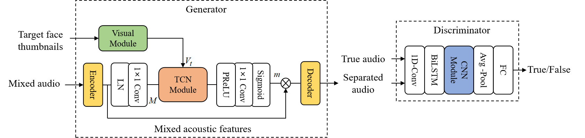
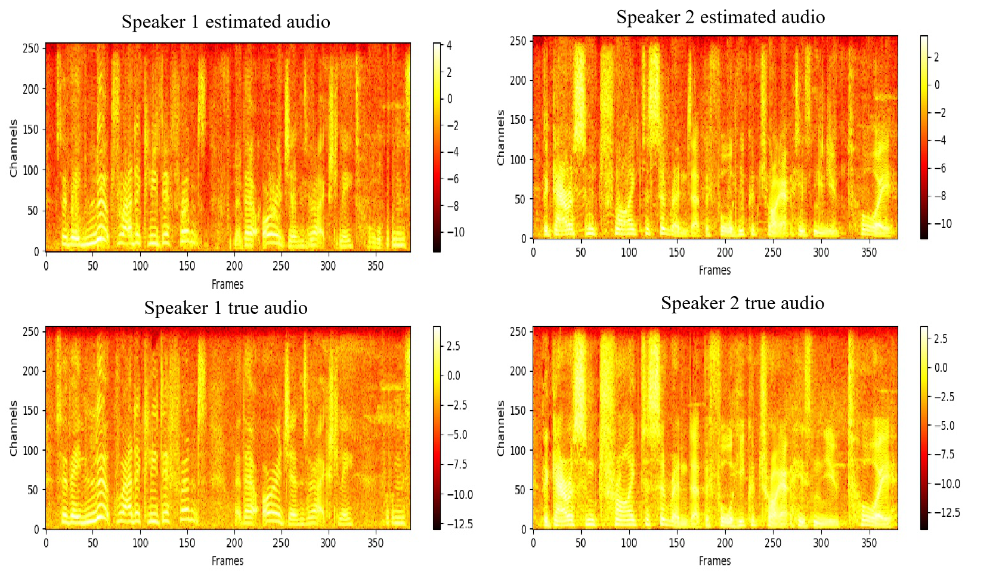

# oavss

## Overview
This is the demo and pytorch implementation of our paper: "Online Audio-Visual Speech Separation with Generative Adversarial Training". In this work, we propose the **causal audio-visual speech separation model** and **streaming inference strategy**, which make our model do online audio-visual speech separation. Besides, **generative adversarial training** is adopted in our model to reduce the effects of SI-SNR, which can reduce the word error rate (WER) of separated audio on public automatic speech recognition (ASR) system (e.g., Baidu ASR).

We will release code soon (you can refer to https://github.com/aispeech-lab/oavss for reproduction). If you have any question about implementation details, feel free to ask me (zhangpeng2018@ia.ac.cn)

<div align=center></div>

## Dataset
We conduct experiments on 2-speaker mixtures created from the [Lip Reading Sentences 2](http://www.robots.ox.ac.uk/~vgg/data/lip_reading/lrs2.html) audio-visual dataset, which consists of thousands of spoken sentences from BBC television with their corresponding transcriptions. The training, validation, and test sets are generated according to the broadcast date. The method of generating 2-speaker mixtures as follows: we randomly select two audios from the dataset, then mix them at a random signal-noise-ratio (SNR) between -5 dB and 5 dB. The corresponding two videos are concatenated to simulate a cocktail party scene. Finally, we simulated 40k, 5k, and 3k utterances for training, validation, and test sets, respectively.

# Result
### Audio samples generated by our online audio-visual speech separation model
- Listen to the audio samples at [*./samples*](./samples)
- Spectrogram sample
<div align=center></div>

### Metric
Table 1: The performance of our models and baseline models on the test set. CF represents concatenate fusion; DCF represents deep concatenate fusion; GAT represents generative adversarial training.
| Models | Online | SDR(dB) | PESQ | STOI(%) | WER(%) |
| --------------- | --- | ---- | --- | --| --- |
| Mixed audio | - | 0.15 | 1.78 | 69 | 72.2 |
| Conv-TasNet | No | 9.60 | 2.58 | 87 | 25.3 |
| advr-AVSS | No | 9.94 | 2.64 | 87 | 22.7|
| Ours(CF) | No | 10.01 | 2.65 | 87 | 22.5 |
| Ours(DCF) | No | 10.30 | 2.68 | 88 | 20.3 |
| Ours(CF+GAT) | No | 10.24 | 2.67 | 87 | 20.1 |
| Ours(DCF+GAT) | No | **10.48** | **2.70** | **88** | **19.2** |
| Conv-TasNet | Yes | 6.25 | 2.22 | 80 | 39.0 |
| Ours(CF) | Yes | 4.95 | 2.13 | 78 | 39.3 |
| Ours(DCF) | Yes | 6.27 | 2.28 | 82 | 32.6 |
| Ours(CF+GAT) | Yes | 5.48 | 2.21 | 79 | 36.1 |
| Ours(DCF+GAT) | Yes | **6.76** | **2.33** | **83** | **30.8** |

Table 2: The run time of our model on the GPU and CPU under different chunk length.
| Chunk length | 40ms | 80ms | 120ms | 160ms | 200ms | 240ms | 280ms|
| ---------- | ---- | ---- | ----- | ----- | ----- | ----- | ----- |
| CPU | 166ms | 167ms | 173ms | 175ms | 178ms | 182ms | 187ms |
| GPU | 24ms | 24ms | 24ms | 25ms | 25ms | 25ms | 25ms |

If you find this repo helpful, please consider citing:

```
@inproceedings{zhang2021online,
  title={Online Audio-Visual Speech Separation with Generative Adversarial Training},
  author={Zhang, Peng and Xu, Jiaming and Hao, Yunzhe and Xu, Bo}
  booktitle={2021 7th International Conference on Computing and Artificial Intelligence (ICCAI)},
  year={2021},
  organization={ACM}
}
```
